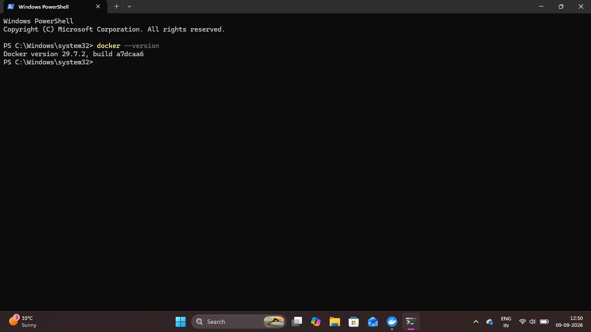
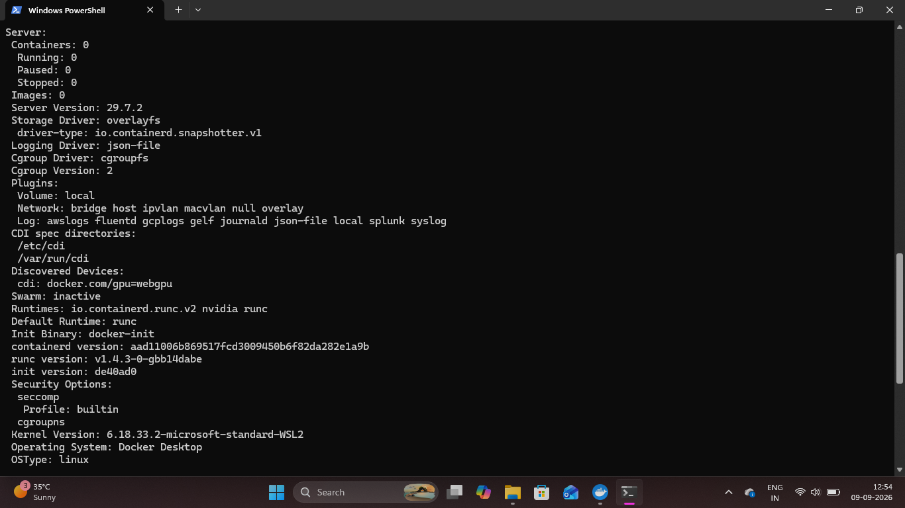
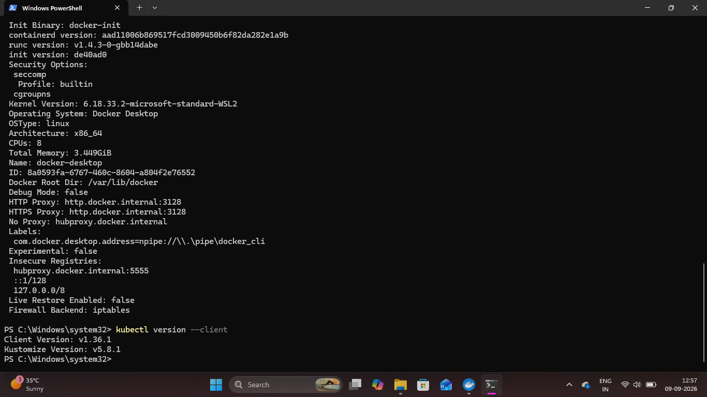
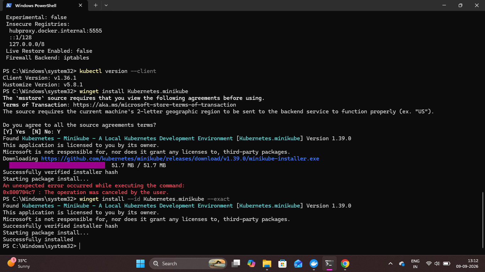
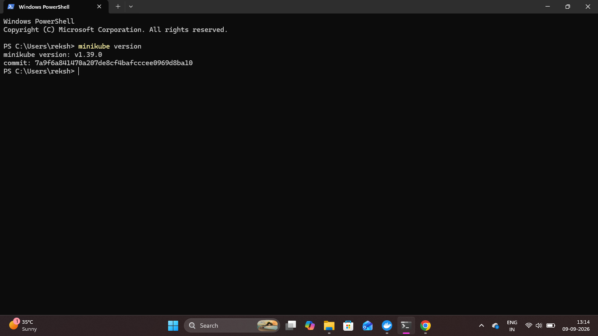
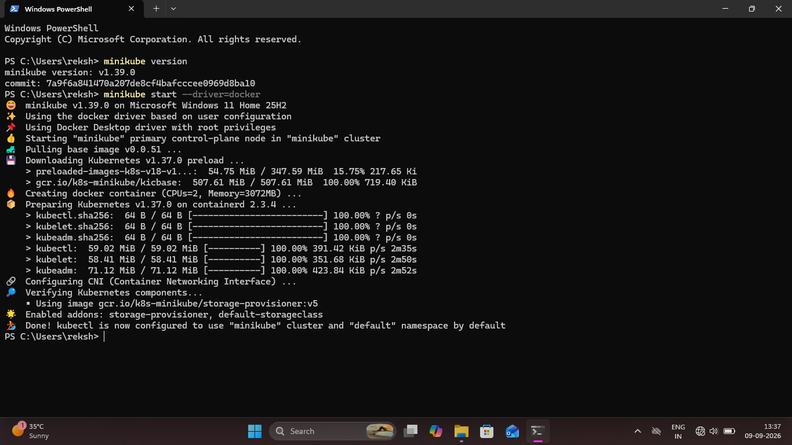
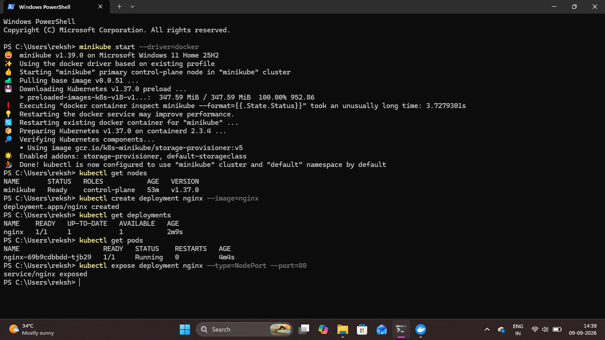

# Environment and Kubernetes Setup

## Overview

This project starts with setting up the container and Kubernetes environment required to deploy and manage applications locally.

Docker Desktop is used as the container runtime, while kubectl is used as the Kubernetes command-line tool. Minikube is then configured to create and run a local Kubernetes cluster using Docker.

## 1. Docker Installation and Verification

Docker Desktop was installed and verified successfully on the local Windows environment.

### Docker Version

```bash
docker --version
```

This command verifies that Docker CLI is installed and available.

### Proof



## 2. Docker Engine Verification

The Docker Engine was verified using:

```bash
docker info
```

This confirms that the Docker Engine is running correctly and provides information about the Docker environment.

### Proof



## 3. kubectl Installation and Verification

kubectl was installed as the Kubernetes command-line tool for interacting with the Kubernetes cluster.

```bash
kubectl version --client
```

This verifies that the kubectl client is installed and ready to communicate with Kubernetes.

### Proof



## 4. Minikube Installation

Minikube was installed to create a local Kubernetes cluster for development and hands-on practice.

```bash
winget install --id Kubernetes.minikube --exact
```

### Proof



## 5. Minikube Version Verification

After installation, the Minikube version was verified.

```bash
minikube version
```

This confirms that Minikube is installed and available for creating the local Kubernetes cluster.

### Proof



## 6. Start the Kubernetes Cluster

The local Kubernetes cluster was started using Docker as the Minikube driver.

```bash
minikube start --driver=docker
```

This creates the local Kubernetes control plane and connects Minikube with the Docker runtime.

### Proof



## 7. Verify Kubernetes Node

The Kubernetes node was verified using:

```bash
kubectl get nodes
```

The node was successfully reported with `Ready` status, confirming that the local Kubernetes cluster was running correctly.

### Proof



## Result

The complete local Kubernetes environment was successfully prepared using Docker Desktop, kubectl, and Minikube. The Kubernetes node was verified in `Ready` state and the environment was ready for application deployment.
