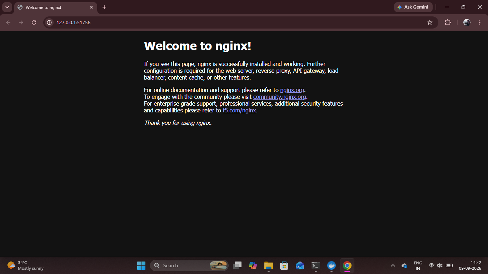

# NGINX Deployment

## Overview

After setting up the local Kubernetes cluster, an NGINX application was deployed to Kubernetes.

The deployment demonstrates how Kubernetes manages an application using a Deployment resource and maintains the desired number of application Pods.

## 1. Create the NGINX Deployment

The NGINX application was deployed using the official NGINX container image.

```bash
kubectl create deployment nginx --image=nginx
```

This command creates a Kubernetes Deployment named `nginx` using the NGINX container image.

## 2. Verify the Deployment

The deployment was verified using:

```bash
kubectl get deployments
```

The NGINX deployment was successfully created and reported `1/1` ready.

## 3. Verify the NGINX Pod

The running Pod was checked using:

```bash
kubectl get pods
```

The NGINX Pod was successfully created and reached the `Running` state.

## 4. Expose NGINX as a Kubernetes Service

The NGINX deployment was exposed through a NodePort Service.

```bash
kubectl expose deployment nginx --type=NodePort --port=80
```

This creates a Kubernetes Service that allows the NGINX application to be accessed through the Minikube environment.

## 5. Access NGINX Application

The NGINX Service was opened using:

```bash
minikube service nginx
```

The default NGINX welcome page was successfully displayed in the browser.

### Proof



## Result

The NGINX application was successfully deployed on Kubernetes, exposed through a NodePort Service, and accessed through the browser.
