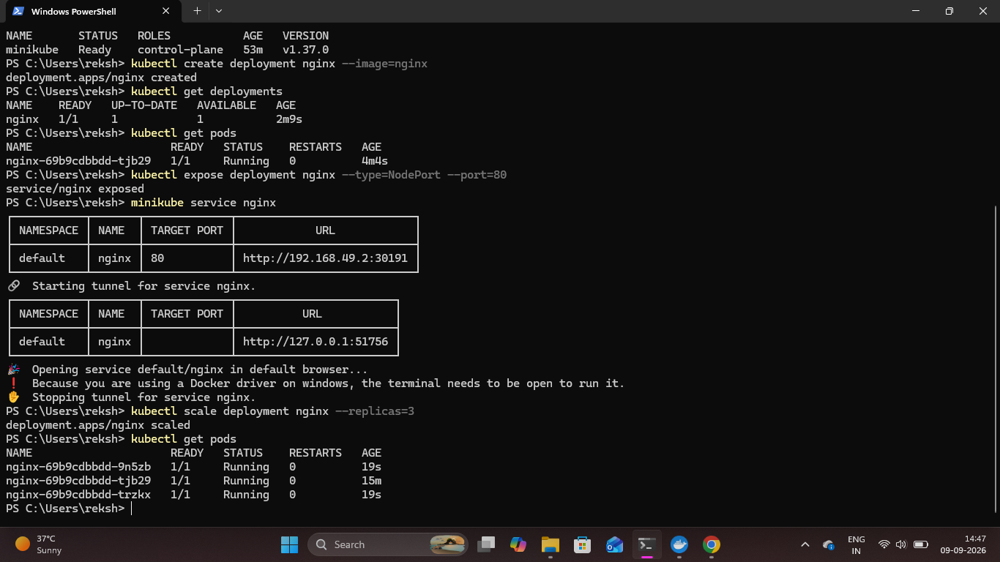
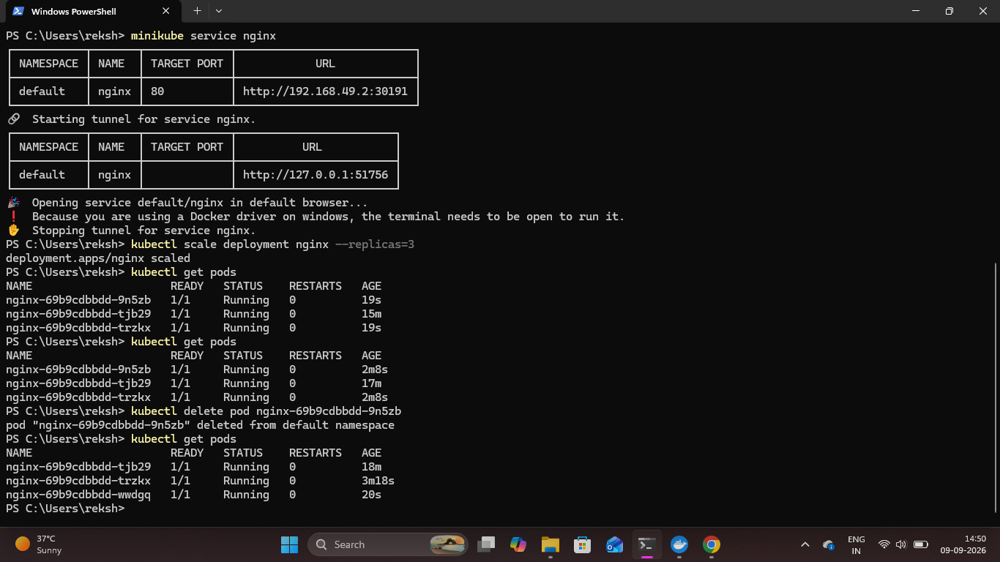

# Kubernetes Scaling and Self-Healing

## Overview

Kubernetes scaling and self-healing capabilities were tested using the NGINX application.

The deployment was scaled from one Pod to three Pods, and then one running Pod was manually deleted to verify that Kubernetes automatically created a replacement Pod to maintain the desired state.

## 1. Scale the NGINX Deployment

The NGINX Deployment was scaled from one replica to three replicas.

```bash
kubectl scale deployment nginx --replicas=3
```

This instructs Kubernetes to maintain three running NGINX Pods.

## 2. Verify Pod Scaling

The Pods were checked using:

```bash
kubectl get pods
```

Three NGINX Pods were successfully created and reached the `Running` state.

### Proof



## 3. Test Kubernetes Self-Healing

One of the running NGINX Pods was manually deleted to simulate a Pod failure.

```bash
kubectl delete pod <POD-NAME>
```

Kubernetes detected that the actual number of Pods was lower than the desired replica count and automatically created a replacement Pod.

## 4. Verify the Replacement Pod

The Pods were checked again using:

```bash
kubectl get pods
```

The deleted Pod was replaced automatically, and the Deployment returned to three running Pods.

### Proof



## Result

The NGINX Deployment was successfully scaled from one to three Pods. Kubernetes self-healing was also verified by deleting a running Pod and observing Kubernetes automatically create a replacement Pod to maintain the desired state.
