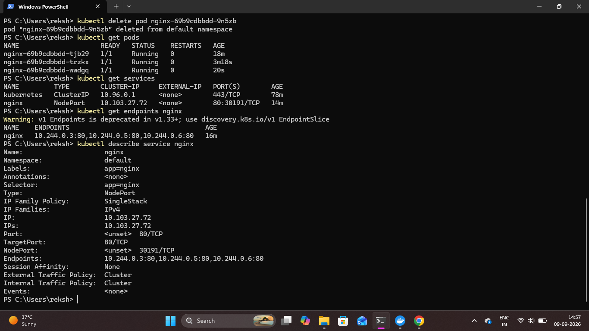

# Kubernetes Service Details

## Overview

The Kubernetes Service configuration for the NGINX application was inspected to understand how the Service connects external traffic to the running Pods.

The Service, endpoints, and detailed Service configuration were verified using kubectl commands.

## 1. View Kubernetes Services

The available Services were checked using:

```bash
kubectl get services
```

This command displays the Service name, type, cluster IP, exposed ports, and current status.

## 2. Check NGINX Service Endpoints

The endpoints connected to the NGINX Service were checked using:

```bash
kubectl get endpoints nginx
```

This verifies the backend Pod IP addresses associated with the Service.

## 3. Describe the NGINX Service

Detailed information about the NGINX Service was inspected using:

```bash
kubectl describe service nginx
```

This provides details such as the Service type, selector, ports, target port, endpoints, and other configuration information.

### Proof



## Result

The NGINX Kubernetes Service was inspected successfully. Its Service configuration and backend Pod endpoints were verified to understand how Kubernetes routes traffic to the application Pods.
