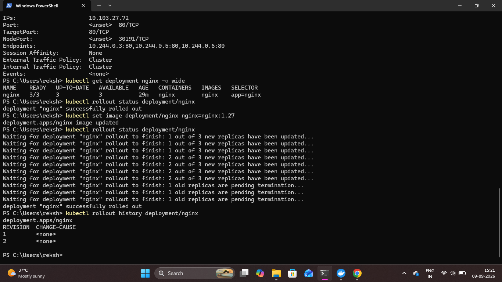

# Kubernetes Rolling Update

## Overview

A rolling update was performed on the NGINX Deployment to demonstrate how Kubernetes can update an application image without manually stopping the entire application.

The NGINX image was updated to version `1.27`, and the rollout status and history were verified.

## 1. Check the Current Deployment

The current NGINX Deployment configuration was checked using:

```bash
kubectl get deployment nginx -o wide
```

This displays the Deployment status, available replicas, container image, and other details.

## 2. Update the NGINX Image

The NGINX container image was updated to version `1.27`.

```bash
kubectl set image deployment/nginx nginx=nginx:1.27
```

Kubernetes creates a new ReplicaSet and gradually replaces the existing Pods with Pods using the updated image.

## 3. Monitor the Rolling Update

The rollout was monitored using:

```bash
kubectl rollout status deployment/nginx
```

This command confirms whether the Deployment rollout has completed successfully.

## 4. Check Rollout History

The Deployment rollout history was viewed using:

```bash
kubectl rollout history deployment/nginx
```

This displays the revision history maintained by Kubernetes for the Deployment.

### Proof



## Result

The NGINX Deployment was successfully updated to `nginx:1.27` using a Kubernetes rolling update. The rollout completed successfully and the Deployment revision history was verified.
