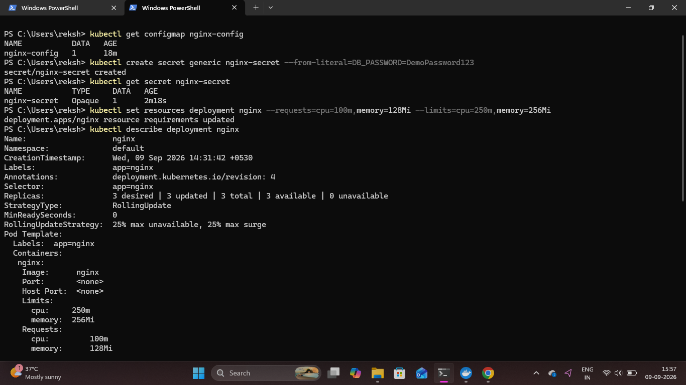

# Kubernetes ConfigMap, Secret and Resource Management

## Overview

Kubernetes configuration and resource management were practiced using ConfigMaps, Secrets, and resource requests and limits.

A ConfigMap was used to store application configuration, while a Secret was created for sensitive configuration data. CPU and memory requests and limits were also configured for the NGINX container.

## 1. Create a ConfigMap

A ConfigMap was created to store a sample application environment value.

```bash
kubectl create configmap nginx-config --from-literal=APP_ENV=development
```

The ConfigMap was verified using:

```bash
kubectl get configmap nginx-config
```

## 2. Create a Kubernetes Secret

A Secret was created to demonstrate how sensitive configuration values can be stored separately from regular configuration.

```bash
kubectl create secret generic nginx-secret --from-literal=DB_PASSWORD=DemoPassword123
```

The Secret was verified using:

```bash
kubectl get secret nginx-secret
```

The value used here is only a demonstration value and should not be used as a real production credential.

## 3. Configure Resource Requests and Limits

CPU and memory requests and limits were configured for the NGINX Deployment.

```bash
kubectl set resources deployment nginx --requests=cpu=100m,memory=128Mi --limits=cpu=250m,memory=256Mi
```

The Deployment configuration was then inspected using:

```bash
kubectl describe deployment nginx
```

This verifies the configured CPU and memory requests and limits for the NGINX container.

### Proof



## Result

The Kubernetes ConfigMap and Secret were successfully created and verified. CPU and memory resource requests and limits were also configured for the NGINX Deployment.
