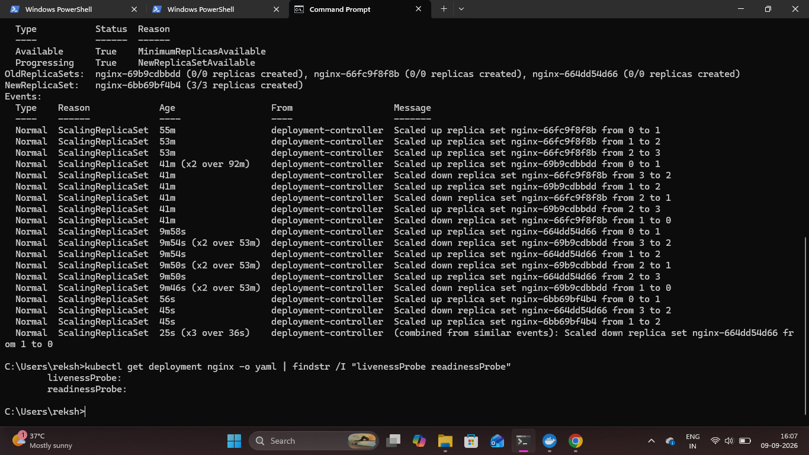

# Kubernetes Health Probes

## Overview

Kubernetes health probes were configured for the NGINX application to allow Kubernetes to monitor the health and readiness of the container.

A liveness probe checks whether the application is still running correctly, while a readiness probe determines whether the application is ready to receive traffic.

## 1. Configure Liveness Probe

A liveness probe was configured to check the NGINX application through its HTTP endpoint.

```bash
kubectl patch deployment nginx --type=json -p "[{\"op\":\"add\",\"path\":\"/spec/template/spec/containers/0/livenessProbe\",\"value\":{\"httpGet\":{\"path\":\"/\",\"port\":80},\"initialDelaySeconds\":10,\"periodSeconds\":10}}]"
```

The liveness probe checks the NGINX HTTP endpoint periodically.

## 2. Configure Readiness Probe

A readiness probe was configured to verify whether the NGINX application is ready to receive traffic.

```bash
kubectl patch deployment nginx --type=json -p "[{\"op\":\"add\",\"path\":\"/spec/template/spec/containers/0/readinessProbe\",\"value\":{\"httpGet\":{\"path\":\"/\",\"port\":80},\"initialDelaySeconds\":5,\"periodSeconds\":5}}]"
```

The readiness probe checks the same HTTP endpoint and helps Kubernetes determine when the Pod is ready to serve requests.

## 3. Verify Health Probes

The configured probes were verified using:

```bash
kubectl get deployment nginx -o yaml | findstr /I "livenessProbe readinessProbe"
```

This confirms that both liveness and readiness probes are present in the NGINX Deployment configuration.

### Proof



## Result

Liveness and readiness probes were successfully configured and verified for the NGINX Deployment. Kubernetes can now use these probes to monitor application health and readiness.
