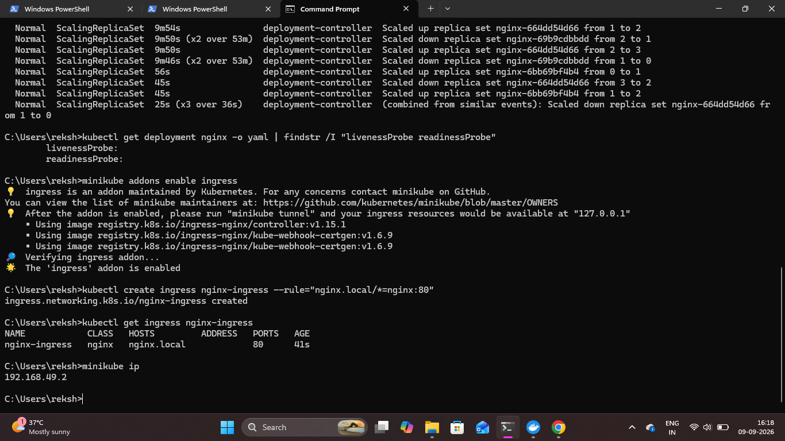

# Kubernetes Ingress

## Overview

Kubernetes Ingress was configured to provide an HTTP routing layer for the NGINX application.

The Minikube Ingress addon was enabled, and an Ingress resource was created to route requests to the NGINX Kubernetes Service.

## 1. Enable the Ingress Addon

The Ingress addon was enabled in the Minikube cluster.

```bash
minikube addons enable ingress
```

This enables the NGINX Ingress Controller in the local Minikube environment.

## 2. Create an Ingress Resource

An Ingress resource was created for the NGINX Service.

```bash
kubectl create ingress nginx-ingress --rule="nginx.local/*=nginx:80"
```

This configuration routes requests matching `nginx.local` to the NGINX Service on port `80`.

## 3. Verify the Ingress

The created Ingress resource was checked using:

```bash
kubectl get ingress nginx-ingress
```

This displays the Ingress configuration and its current status.

### Proof



## Result

The Minikube Ingress addon was successfully enabled and an Ingress resource was created to route HTTP traffic to the NGINX Service.
