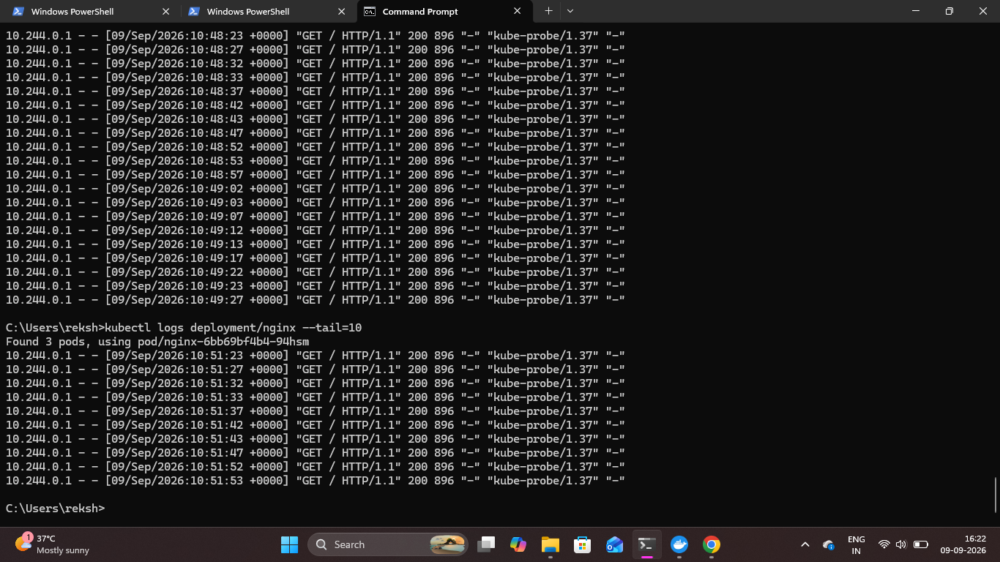

# Kubernetes Logging

## Overview

Kubernetes application logs were inspected to understand how container output can be viewed and used during application monitoring and troubleshooting.

The NGINX Deployment logs were checked using kubectl without directly accessing the container.

## 1. View NGINX Deployment Logs

The logs generated by the NGINX Deployment were viewed using:

```bash
kubectl logs deployment/nginx
```

This command retrieves logs from the Pods managed by the NGINX Deployment.

## 2. View Recent Logs

To focus on the most recent log entries, the following command was used:

```bash
kubectl logs deployment/nginx --tail=10
```

The `--tail=10` option limits the output to the latest 10 log lines, making it easier to inspect recent application activity.

### Proof



## Result

The NGINX application logs were successfully retrieved using kubectl. Recent log entries were reviewed to demonstrate basic Kubernetes application logging and monitoring.
