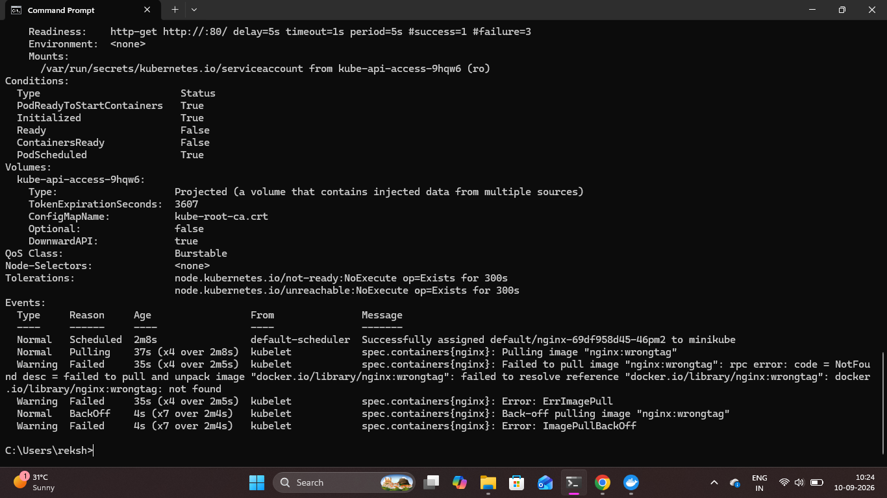

# Kubernetes Troubleshooting

## Overview

A deployment failure was intentionally simulated to practice a real-world Kubernetes troubleshooting workflow.

An invalid NGINX image tag was configured, which caused the affected Pod to enter an `ImagePullBackOff` state. The issue was then investigated using Pod details and Kubernetes events.

## 1. Simulate an Application Deployment Issue

An invalid NGINX image tag was intentionally configured:

```bash
kubectl set image deployment/nginx nginx=nginx:wrongtag
```

This was done intentionally to simulate an image deployment failure.

## 2. Check Pod Status

The Pods were checked to identify the affected Pod:

```bash
kubectl get pods
```

The affected Pod entered an unhealthy state because Kubernetes could not pull the specified image.

## 3. Inspect the Problematic Pod

Detailed information about the affected Pod was inspected using:

```bash
kubectl describe pod <PROBLEM-POD-NAME>
```

The output showed:

- Image: `nginx:wrongtag`
- State: `Waiting`
- Reason: `ImagePullBackOff`
- Readiness: `False`
- Event: Failed to pull the image
- Event: `ErrImagePull`
- Event: `ImagePullBackOff`

These details helped identify the invalid container image as the root cause.

### Proof



## 4. Restore the Correct Image

After identifying the issue, the NGINX image was changed back to the valid version:

```bash
kubectl set image deployment/nginx nginx=nginx:1.27
```

The rollout was then monitored:

```bash
kubectl rollout status deployment/nginx
```

Finally, the Pods were verified:

```bash
kubectl get pods
```

The affected Pod was replaced and the Deployment returned to a healthy state.

## Result

A Kubernetes image deployment failure was successfully simulated, investigated, and recovered.

The troubleshooting process demonstrated how `kubectl get pods` and `kubectl describe pod` can be used to identify Pod failures and Kubernetes events, followed by restoring the correct container image.
