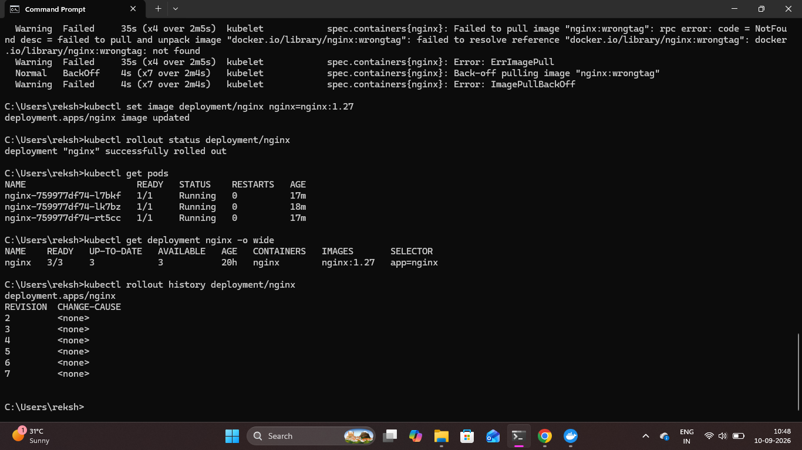
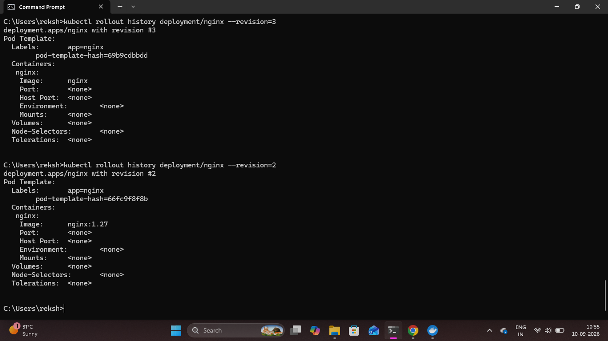

# Kubernetes Rollout History and Revision Management

## Overview

Kubernetes Deployment revisions were reviewed to understand how changes to an application are recorded and how previous versions can be identified before performing a rollback.

The NGINX Deployment rollout history was inspected, and individual revisions were checked to identify a known safe application version.

## 1. View Rollout History

The rollout history of the NGINX Deployment was viewed using:

```bash
kubectl rollout history deployment/nginx
```

This command displays the revisions maintained for the Deployment.

The revision history included multiple changes made during the deployment and troubleshooting stages.

### Proof



## 2. Inspect a Specific Revision

A known working revision was inspected using:

```bash
kubectl rollout history deployment/nginx --revision=2
```

Revision `2` was identified as using the valid NGINX image:

```text
nginx:1.27
```

This revision was selected as the safe revision for the rollback demonstration.

### Proof



## Result

The Kubernetes rollout history was successfully reviewed and a known working Deployment revision was identified.

This demonstrated how Kubernetes maintains Deployment revisions and how revision history can be used to make safer rollback decisions.
