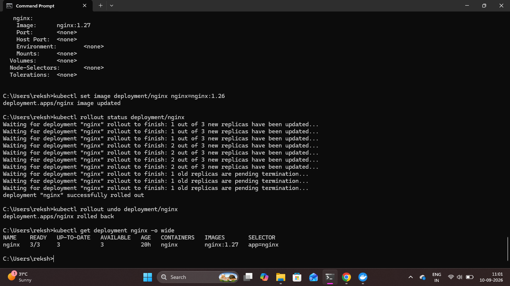

# Kubernetes Rollback

## Overview

Kubernetes rollback was performed to demonstrate how a Deployment can be safely returned to a previous working revision after an application update.

A temporary NGINX image change was introduced, and the Deployment was then rolled back to the previously verified working revision.

## 1. Introduce a Temporary Image Change

A temporary NGINX image version was deployed to simulate a change that may need to be reverted.

```bash
kubectl set image deployment/nginx nginx=nginx:1.26
```

This creates a new Deployment revision containing the updated image.

## 2. Monitor the Deployment

The rollout was monitored using:

```bash
kubectl rollout status deployment/nginx
```

This confirms that the temporary Deployment update was completed.

## 3. Roll Back the Deployment

The Deployment was reverted to the previous revision using:

```bash
kubectl rollout undo deployment/nginx
```

Kubernetes restored the previous Deployment revision.

## 4. Verify the Rollback

The Deployment configuration was checked using:

```bash
kubectl get deployment nginx -o wide
```

The Deployment was verified after the rollback to confirm that the previous application version had been restored.

### Proof



## Result

The Kubernetes Deployment was successfully rolled back to its previous revision.

This demonstrated how Kubernetes rollout history and `kubectl rollout undo` can be used to recover from an unwanted application update.
