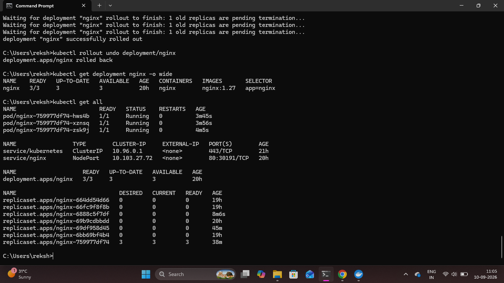

# Kubernetes Final Health Check

## Overview

A final health check was performed after completing the Kubernetes deployment, configuration, troubleshooting, and rollback activities.

The Kubernetes resources were reviewed together to confirm that the NGINX application was running successfully and that the cluster had returned to a healthy state.

## 1. Check All Kubernetes Resources

The complete Kubernetes resource status was checked using:

```bash
kubectl get all
```

This command provides an overall view of the Pods, Services, Deployments, and ReplicaSets associated with the application.

## 2. Verify Application Pods

The final output confirmed that:

- 3 NGINX Pods were running
- All Pods were `1/1` ready
- No Pod restarts were reported
- The Deployment had 3 available replicas

## 3. Verify the Kubernetes Service

The NGINX Service was also present as a NodePort Service and remained available for application access.

## 4. Verify the Deployment

The NGINX Deployment was confirmed to have:

- 3 desired replicas
- 3 current replicas
- 3 ready replicas
- 3 available replicas
- 3 up-to-date replicas

The active ReplicaSet also showed all three replicas ready.

### Proof



## Result

The final Kubernetes health check confirmed that the NGINX application and its supporting Kubernetes resources were in a healthy state.

The local Kubernetes deployment workflow, including deployment, scaling, self-healing, service exposure, rolling updates, configuration, health probes, Ingress, logging, troubleshooting, rollout history, and rollback, was successfully completed.

## Project Status

The local Kubernetes phase of the project is complete.

The next planned stage is to extend the project toward cloud-based Kubernetes operations using AWS ECR and Amazon EKS.
