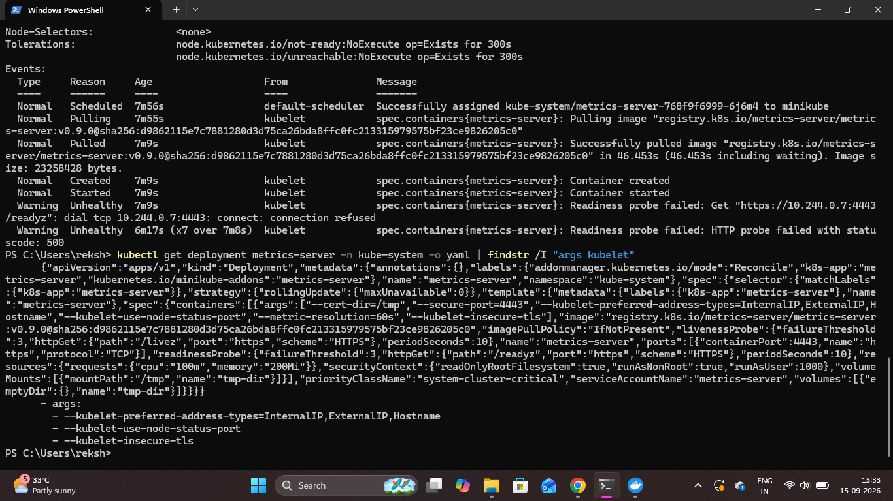
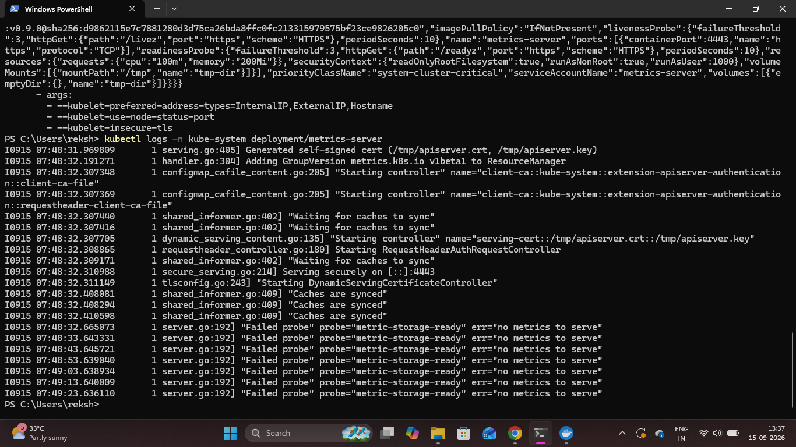
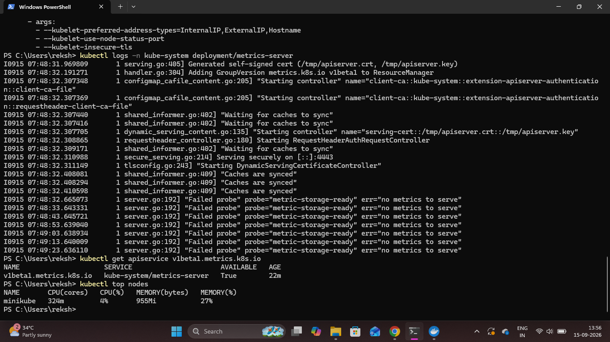
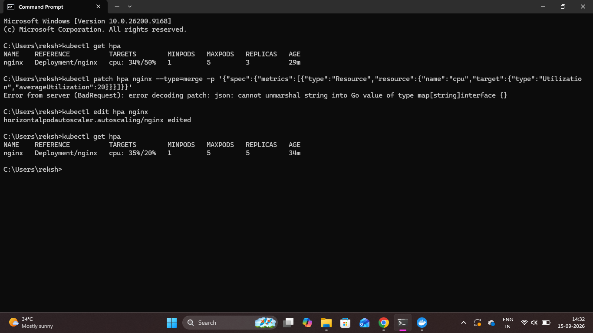
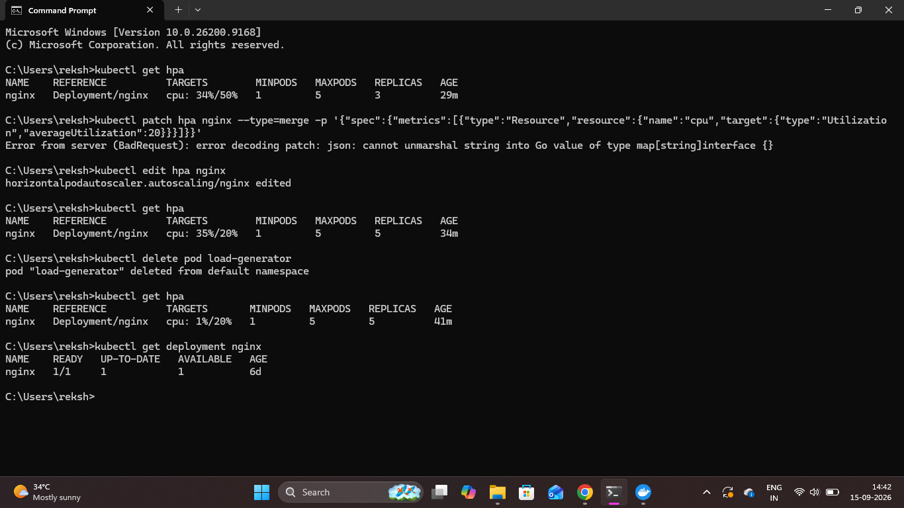

# Metrics Server and Horizontal Pod Autoscaler (HPA)

## Overview

This phase extended the Kubernetes application with resource monitoring and automatic pod scaling using Metrics Server and Horizontal Pod Autoscaler (HPA).

The existing NGINX deployment was used to demonstrate how Kubernetes can automatically increase or decrease the number of pods based on CPU utilization.

## Enable Metrics Server

Minikube's Metrics Server addon was enabled to collect CPU and memory usage.

    minikube addons enable metrics-server

The Metrics Server initially showed a readiness issue while metrics were becoming available.

### Proof

## Troubleshoot Metrics Server

The Metrics Server logs were checked to identify the reason for the readiness issue.

    kubectl logs -n kube-system deployment/metrics-server

The logs showed that the Metrics Server started successfully but initially had no metrics available to serve.

### Proof

The Metrics API was then verified.

    kubectl get apiservice v1beta1.metrics.k8s.io

The Metrics API became available successfully.

## Verify Kubernetes Node Metrics

Once the Metrics Server was ready, CPU and memory usage of the Minikube node were checked.

    kubectl top nodes

### Proof

The output confirmed that Kubernetes was successfully collecting resource metrics.

## Create Horizontal Pod Autoscaler

An HPA was created for the existing NGINX deployment.

    kubectl autoscale deployment nginx --cpu-percent=50 --min=1 --max=5

The HPA was configured with:

- Minimum replicas: 1
- Maximum replicas: 5
- CPU utilization target: 50%

The CPU target was later changed to 20% for the local scaling demonstration so that the test workload could trigger automatic scaling.

## Generate CPU Load

A temporary BusyBox pod was created to generate continuous HTTP requests against the NGINX service.

    kubectl run load-generator --image=busybox:1.36 --restart=Never -- /bin/sh -c "while true; do wget -q -O- http://nginx; done"

CPU usage was monitored using:

    kubectl top pods

The generated workload increased CPU utilization on the NGINX pods.

## HPA Automatic Scale-Up

With the CPU load running, the Horizontal Pod Autoscaler detected increased CPU utilization and automatically increased the number of NGINX replicas.

The deployment scaled from:

**3 replicas → 5 replicas**

The HPA allowed the deployment to scale between 1 and 5 replicas.

### Proof

This confirmed that Kubernetes automatically increased the number of pods based on CPU utilization.

## Remove Test Load

After verifying the scale-up, the temporary load-generator pod was removed.

    kubectl delete pod load-generator

Once the workload stopped, CPU utilization decreased.

## HPA Automatic Scale-Down

After the CPU load was removed, the HPA automatically reduced the NGINX deployment back to the configured minimum replica count.

The deployment scaled from:

**5 replicas → 1 replica**

The deployment status was verified using:

    kubectl get deployment nginx

### Proof

The output confirmed that the NGINX deployment had returned to 1 running replica.

## Kubernetes Concepts Demonstrated

- Metrics Server
- Kubernetes resource monitoring
- CPU utilization
- Horizontal Pod Autoscaler
- Automatic horizontal scaling
- HPA scale-up
- HPA scale-down
- Minimum and maximum replica limits
- Workload-based pod management

## Final Result

The NGINX application was successfully extended with Kubernetes resource monitoring and automatic horizontal scaling.

### Scaling Proof

**Scale Up:** 3 → 5 replicas

**Scale Down:** 5 → 1 replica

This demonstrated how Kubernetes can automatically adjust application capacity based on workload.
